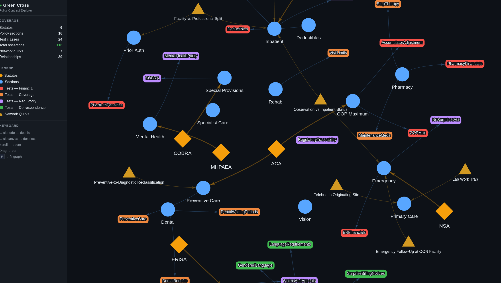

# Risk-Based Contract Verification

Unit tests that audit health insurance policy contracts against their source terms. Each test maps to a specific financial, regulatory, or compliance risk — if it fails, something real breaks: a wrong deductible, a parity violation, a member getting balance-billed.



## Quick Start

```bash
# run the test suite
./test.sh

# run specific risk category
./test.sh -k financial
./test.sh -k regulatory
./test.sh -k correspondence

# explore the contract graph
./explore.sh
```

## How It Works

The policy contract document (`contracts/green-cross-policy.md`) is the source of truth. It's modeled as typed Pydantic models (`policy/models.py`), instantiated with actual contract values (`policy/green_cross.py`), and verified by risk-annotated pytest assertions.

```
contracts/green-cross-policy.md       ← source document
regulations/base_policies.jsonl       ← statutes, citations, governs mappings
        │
policy/models.py                      ← typed schema (Pydantic)
policy/regulations.py                 ← RegulatoryRegistry loader
policy/green_cross.py                 ← contract data (loads regulations from JSONL)
        │
tests/test_financial_accuracy.py      ← deductibles, OOP, accumulators
tests/test_benefit_determination.py   ← coverage, limits, dental, pharmacy
tests/test_regulatory.py              ← MHPAEA, No Surprises Act, COBRA, ERISA
tests/test_correspondence.py          ← gendered language, state rules, translations
```

Every test has a docstring explaining the risk if it fails:

```python
def test_er_copay_waived_on_admission(self, policy):
    """Risk: Member double-charged (ER copay + inpatient copay)
    when admitted from ER. Direct financial harm."""
    assert policy.emergency.er.copay_waived_if_admitted is True
```

## Risk Categories

| Category | Tests | What Breaks |
|----------|-------|-------------|
| **Financial** | 28 | Member overcharged, plan overpays, accumulator errors |
| **Coverage** | 31 | Claims denied incorrectly, wrong limits applied |
| **Regulatory** | 24 | MHPAEA parity, No Surprises Act, COBRA, ERISA violations |
| **Correspondence** | 23 | Wrong pronouns by state, missing translations, absent disclosures |

## Regulatory Traceability

Regulatory references live in `regulations/base_policies.jsonl` — one statute per line, inspectable with `cat`, `jq`, or `grep`. The `RegulatoryRegistry` loads them at runtime and provides the governs graph to both the policy instance and the explorer.

```bash
# what governs emergency care?
grep emergency regulations/base_policies.jsonl | jq .id

# all statutes with CFR references
jq -r 'select(.references[].cfr != null) | .id' regulations/base_policies.jsonl
```

| Statute | Citation | Governs |
|---------|----------|---------|
| ACA | 42 USC § 18001 | Preventive care, OOP maximums |
| MHPAEA | 29 USC § 1185a | Mental health parity |
| No Surprises Act | PL 116-260 | Emergency billing protections |
| NMHPA | 29 USC § 1185 | Maternity minimum stays |
| COBRA | 29 USC § 1161 | Continuation coverage |
| ERISA | 29 USC § 1001 | Claims and appeals process |

## Explorer

`./explore.sh` launches an interactive graph at `localhost:8787` showing the full contract topology — statutes, policy sections, test coverage, and network quirks with their risk annotations. Click any node for drill-down details.

See [docs/explorer.md](docs/explorer.md) for details.

## Project Structure

```
contracts/          source policy documents
regulations/        externalized regulatory references (JSONL)
policy/             Pydantic models + contract instances
  models.py         typed contract schema
  regulations.py    RegulatoryRegistry — loads + indexes JSONL
  green_cross.py    Green Cross PPO Select data
tests/              risk-annotated test suite
tools/              explorer visualization server
```
