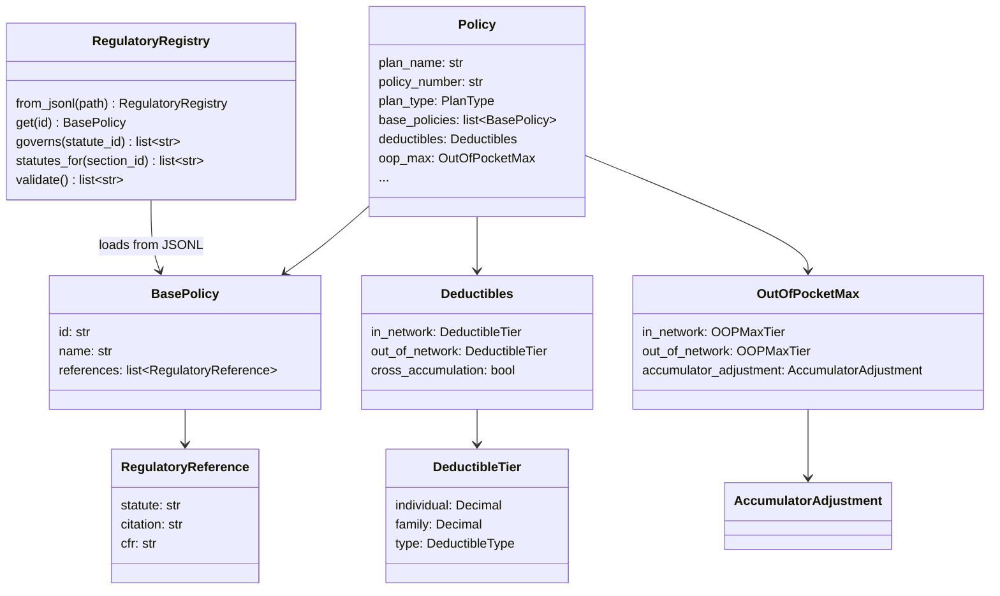

# Contract Model

The policy contract is modeled as a hierarchy of Pydantic models in `policy/models.py`, instantiated with actual contract values in `policy/green_cross.py`.

## Design Principles

**Contract-as-code.** The source document (`contracts/green-cross-policy.md`) is a human-readable reference. The Pydantic models are the machine-readable representation. Tests assert against the models, not the document.

**Regulatory traceability.** Statutes live in `regulations/base_policies.jsonl` — externalized, greppable, editable without touching Python. The `RegulatoryRegistry` loads them and provides the governs graph. Benefit sections get their `base_policies` from the registry at build time. Tests verify these links exist.

**Risk annotation.** Tests don't just assert values — their docstrings explain what breaks if the assertion fails. This turns the test suite into a risk register.

## Model Hierarchy



## Key Models

### Financial

| Model | Purpose |
|-------|---------|
| `Deductibles` | In/out-of-network deductible tiers, embedded vs non-embedded, cross-accumulation |
| `OutOfPocketMax` | OOP limits, what counts/doesn't, accumulator adjustment program |
| `CostShare` | Copay, coinsurance, deductible applicability for any service |

### Benefits

| Model | Purpose |
|-------|---------|
| `PreventiveCare` | Services, frequency, age/gender rules, reclassification traps |
| `EmergencyCare` | ER copay/coinsurance, prudent layperson, admission waiver |
| `InpatientCare` | Admission cost share, observation status rules, maternity minimums |
| `MentalHealthBenefits` | Parity compliance flags, cost share parity with medical |
| `PharmacyBenefits` | Tier copays, step therapy, maintenance med rules, mandatory generic |
| `DentalBenefits` | Class I/II/III coverage, waiting periods, missing tooth clause |

### Compliance

| Model | Purpose |
|-------|---------|
| `RegulatoryRegistry` | Loads statutes from JSONL, indexes governs graph, provides lookups |
| `BasePolicy` | Statute name, USC citation, CFR reference (loaded from JSONL) |
| `PriorAuthorization` | Required services, penalty rules, member-held-harmless |
| `CorrespondenceRules` | Pronoun defaults, state-specific language/disclosure requirements |
| `ClaimsAndAppeals` | Filing deadlines, appeal levels, member rights |

## Regulatory Registry

Regulatory references are externalized in `regulations/base_policies.jsonl`. Each line is one statute:

```json
{"id": "NSA", "name": "No Surprises Act", "description": "...", "references": [{"statute": "...", "citation": "...", "cfr": "..."}], "governs": ["emergency"]}
```

The `RegulatoryRegistry` class (`policy/regulations.py`) loads this file and provides:

| Method | Returns |
|--------|---------|
| `registry.get("NSA")` | `BasePolicy` for that statute |
| `registry.governs("ACA")` | `["preventive_care", "oop_max"]` |
| `registry.statutes_for("emergency")` | `["NSA"]` |
| `registry.base_policies_for("emergency")` | `[BasePolicy(id="NSA", ...)]` |
| `registry.validate()` | List of issues (missing citations, etc.) |
| `registry.all()` | All `BasePolicy` objects |

The policy instance (`green_cross.py`) uses the registry to populate `base_policies` fields:

```python
registry = RegulatoryRegistry.from_jsonl("regulations/base_policies.jsonl")

# benefit sections get their statute links from the registry
emergency=EmergencyCare(
    base_policies=registry.statutes_for("emergency"),
    ...
)
```

To add a new regulation, add a line to the JSONL — no Python changes needed.

## Adding a New Policy

To model a second plan (e.g., a high-deductible variant):

1. Create `policy/green_cross_hdhp.py`
2. Instantiate `Policy(...)` with the HDHP values — it uses the same `registry`
3. Add a pytest fixture in `tests/conftest.py`
4. Parametrize tests across both plans, or write plan-specific tests

The models and regulations don't change — only the data instance does.
